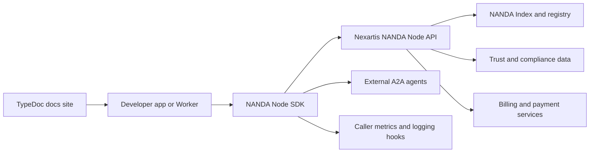
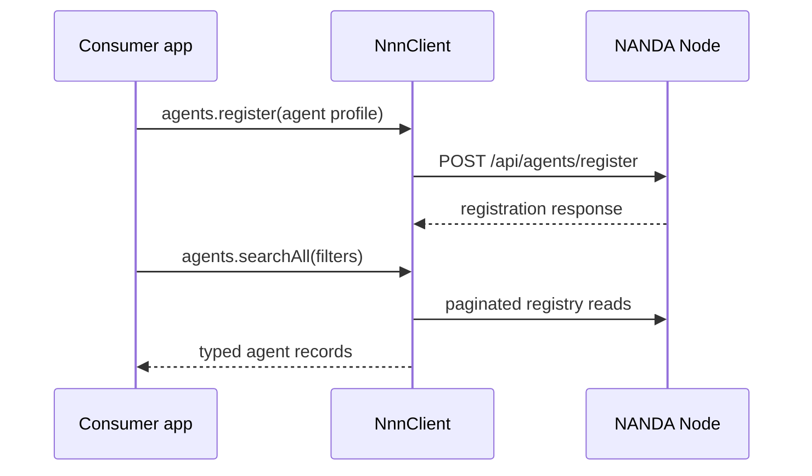
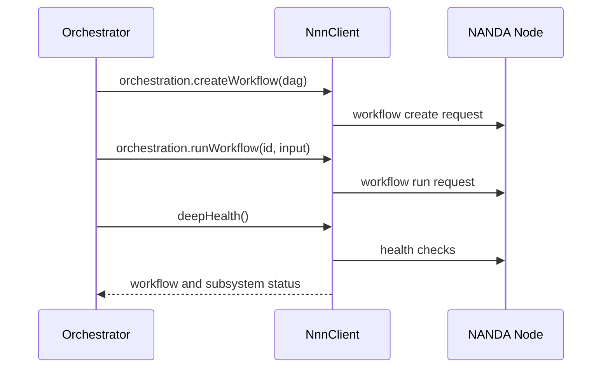

# Nexartis NANDA Node SDK Product Architecture

## Executive summary

`@nexartis/nexartis-nanda-node-sdk` is the official TypeScript client for the Nexartis NANDA Node. It helps agent builders, orchestrator developers, and edge-app teams register agents, discover peers, route A2A requests, run DAG workflows, inspect trust metadata, manage webhooks and developer keys, and interact with billing/payment endpoints exposed by a NANDA Node.

The package is an SDK, not the NANDA Node runtime. It ships typed ESM output, declaration files, examples, and a generated TypeDoc site. The public docs site is deployed separately from the package as a Cloudflare Worker in `typedoc-site/`.

## Product overview

Project NANDA provides a decentralized discovery and trust layer for AI agents. Nexartis NANDA Node is Nexartis' implementation of that protocol. This SDK is the consumer-facing TypeScript entry point for applications that need to talk to a NANDA Node without hand-writing HTTP calls.

Primary audiences:

- Agent developers registering, updating, refreshing, versioning, deprecating, or tombstoning agents.
- Orchestrator developers creating workflows, routing tasks, resolving protocol endpoints, and sending A2A requests.
- Trust/compliance consumers reading scores, frameworks, behavior analytics, compliance scans, and trust graphs.
- Platform developers managing webhooks, developer API keys, earnings actions, invoices, subscriptions, checkout sessions, and NP payment verification.
- Documentation readers using the hosted TypeDoc site at `https://nnn-sdk.nexartis.com`.

## Current capabilities

| Area | Current capability |
|---|---|
| Agent registry | Register, update, delete, lookup, search, list, refresh, version, deprecate, and tombstone agents. |
| Discovery and routing | NANDA index reads, best-match routing, A2A JSON-RPC, protocol lookup/discovery/export/resync, and adapter listing. |
| Orchestration | Create/update/run/cancel DAG workflows, inspect workflow runs, delegate tasks, manage patterns, and raise/resolve conflicts. |
| Trust | Trust scores, frameworks, reputation, Lean Index resolution, compliance scans, behavior analytics, trust graph, and trust path reads. |
| Federation | Peer discovery, gossip status, federated agent listing, and A2A forwarding. |
| Webhooks | CRUD-style subscription management; create responses can include a signing secret. |
| Developers | API-key lifecycle plus developer earnings actions. |
| Billing/payments | Subscriptions, invoices, checkout sessions, NP payment verification, currencies, wallet balances, exchange rates, and conversion helpers. |
| Reliability | Retry/backoff, optional circuit breaker, optional response cache, in-flight GET deduplication, idempotency headers, hooks, trace context propagation, and typed errors. |

## System context

## Main product flows

### Register and discover an agent

### Route a workflow and observe health

## Product boundaries

- The SDK does not host a registry, store agent state, or process payments itself; it calls a NANDA Node API.
- The SDK does not own consumer authentication flows beyond forwarding an optional API key as a bearer token.
- The SDK strips registry authorization headers for off-domain A2A calls to avoid leaking credentials.
- The package has zero runtime dependencies and relies on platform `fetch`.
- Browser use depends on the target NANDA Node's CORS configuration.
- The TypeDoc site is a deployable Cloudflare Worker, but the SDK package itself is not a deployed service.

## Integrations and dependencies

- Runtime: Node.js 20+, Bun, Deno, Cloudflare Workers, and modern browsers with `fetch`.
- Build/test/docs: TypeScript, Vitest, TypeDoc, Size Limit, pnpm.
- Publishing: npmjs public package with provenance via GitHub Actions.
- Docs hosting: Cloudflare Worker in `typedoc-site/` with dev and prod environments.
- Example edge consumer: `examples/workers-agent/` demonstrates a Worker calling `deepHealth()`.

## Security and privacy considerations

- API keys are passed through `Authorization: Bearer <key>` only for NANDA Node requests.
- Off-domain A2A requests use external headers that remove authorization.
- Webhook creation can return a signing secret; applications must store that outside logs and source control.
- Local examples document `NNN_API_KEY` as a secret and do not require a token to install the public npm package.
- Release provenance and npm Trusted Publishing are part of the package integrity model.

## Lifecycle notes

- Development targets `dev`; release publication and production docs deployment happen from `prod`.
- `release-please` manages changelog and release PRs.
- The root package publishes SDK artifacts. `typedoc-site/` is a private docs-site package and is not published to npm.
- Generated `dist/` and TypeDoc output should be regenerated through package scripts rather than hand-edited.

## Related docs

- [Testing strategy](./TESTING.md)
- [Known issues and audit findings](./ISSUES.md)
- [Roadmap](./ROADMAP.md)
- [Document inventory](./DOCUMENT_INVENTORY.md)
